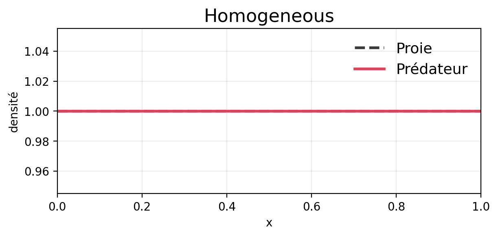
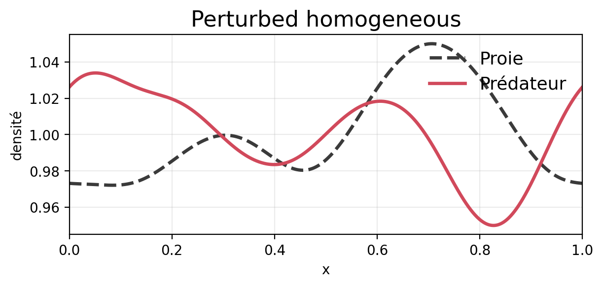
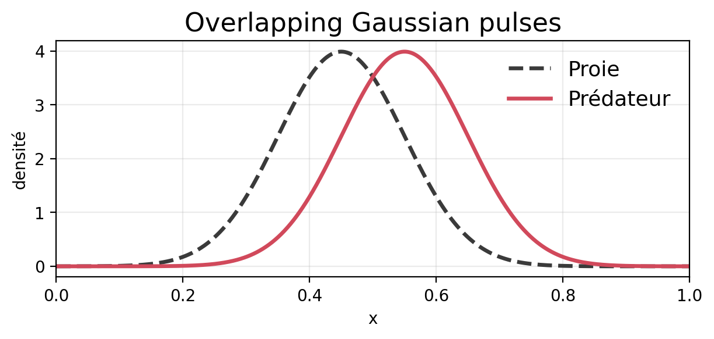
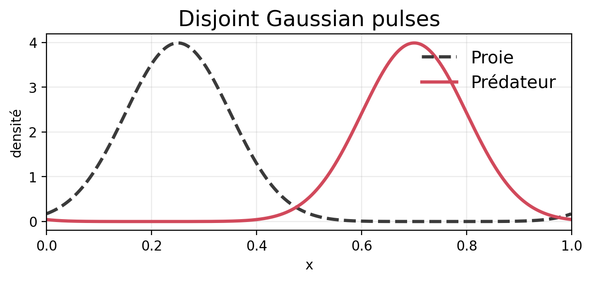

# Conditions initiales comparees

Ce document resume les quatre conditions initiales utilisees dans
`payoff_weight_nash_initial_condition_heatmap.py` pour comparer la sensibilite
des cartes de strategies dominantes au seul choix du profil spatial initial.

Le domaine spatial est periodique sur $[0,1)$. Pour chaque population, le
profil est normalise de sorte que la masse initiale verifie
$m_i(0)=\int_0^1 u_i(x,0)\,dx = 1$. En consequence, la masse totale initiale est
toujours egale a $2$.

Dans les figures ci-dessous, la courbe grise pointillee correspond a la proie
et la courbe rouge continue au predateur.

## Resume des masses initiales

| Condition | Masse proie | Masse predateur | Masse totale |
| --- | ---: | ---: | ---: |
| Homogeneous | 1.000000 | 1.000000 | 2.000000 |
| Perturbed homogeneous | 1.000000 | 1.000000 | 2.000000 |
| Overlapping Gaussian pulses | 1.000000 | 1.000000 | 2.000000 |
| Disjoint Gaussian pulses | 1.000000 | 1.000000 | 2.000000 |

## 1. Homogeneous

Condition initiale spatialement homogene pour les deux populations.

- Proie: profil constant.
- Predateur: profil constant.
- Masse initiale: $m_1(0)=1$, $m_2(0)=1$.

## 2. Perturbed homogeneous

Condition quasi homogene obtenue en ajoutant une petite perturbation lisse au
profil constant.

- Amplitude de perturbation: $0.05$.
- Longueur de lissage: $0.08$.
- Seed aleatoire: $0$.
- Masse initiale: $m_1(0)=1$, $m_2(0)=1$.

## 3. Overlapping Gaussian pulses

Deux bosses gaussiennes proches, avec recouvrement important entre la proie et
le predateur.

- Centres: $x_1=0.45$, $x_2=0.55$.
- Largeur commune: $\sigma=0.1$.
- Masse initiale: $m_1(0)=1$, $m_2(0)=1$.

## 4. Disjoint Gaussian pulses

Deux bosses gaussiennes separees, avec peu de recouvrement initial entre les
deux populations.

- Centres: $x_1=0.25$, $x_2=0.70$.
- Largeur commune: $\sigma=0.1$.
- Masse initiale: $m_1(0)=1$, $m_2(0)=1$.

## Remarque

Les quatre conditions different uniquement par leur forme spatiale initiale.
La normalisation impose la meme masse a chaque population dans tous les cas,
ce qui permet de comparer les effets de la geometrie initiale sans changer la
quantite totale initiale de proies ou de predateurs.